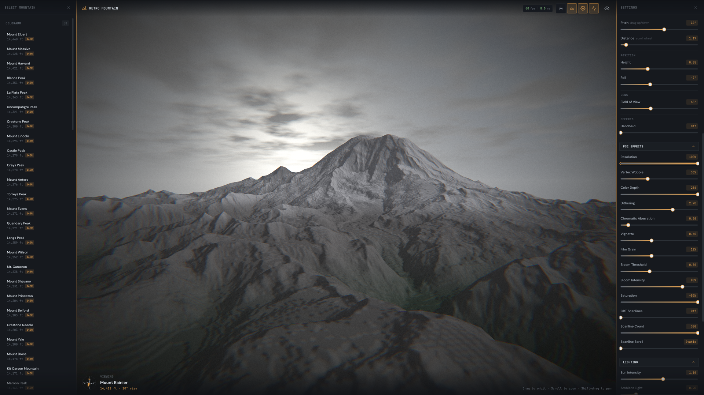

# Retro Mountain Viewer

PS2-style terrain viewer using real USGS 3DEP elevation data with WebGPU.



## Features

- Real elevation data from USGS 3DEP (10m resolution)
- Authentic PS2 visual effects: vertex wobble, Bayer dithering, color quantization, low-res upscaling
- Procedural clouds and sky
- Interactive camera controls (drag to orbit, scroll to zoom)
- Scrollable mountain selector grouped by state
- Extensive parameter controls for effects, terrain, lighting, and colors

## Quick Start

```bash
npm install
npm run generate-mountains
npm run dev
```

Open http://localhost:5173 in a WebGPU-compatible browser (Chrome 113+, Edge 113+, or Firefox Nightly with flags).

A sample Mt. Rainier heightmap is included. Fetch additional heightmaps (see "Adding New Mountains") to expand the dataset.

## Scripts

| Command | Description |
|---------|-------------|
| `npm run dev` | Start development server |
| `npm run build` | Build for production (auto-generates mountain config) |
| `npm run generate-mountains` | Regenerate `src/lib/mountains.json` from heightmaps |

## Adding New Mountains

Use the included GDAL script to fetch elevation data:

```bash
./scripts/fetch_mountain.sh <name> <west> <south> <east> <north> [max_elev]

# Example: Mt. Rainier
./scripts/fetch_mountain.sh rainier -121.84 46.80 -121.68 46.92 4392
```

After fetching, regenerate the mountain config:

```bash
npm run generate-mountains
```

See `docs/DEM-Heightmap-Guide.md` for detailed instructions on fetching elevation data.

## Tech Stack

- Svelte 5
- TypeScript
- WebGPU
- Vite
- GDAL (for elevation data processing)

## Controls

- **Mouse drag**: Orbit camera
- **Scroll wheel**: Zoom in/out
- **U key**: Toggle UI visibility
- **R key**: Reset camera
- **Double-tap** (mobile): Toggle UI
- **Auto Spin**: Toggle automatic rotation
- **Control panel**: Adjust all visual parameters in real-time

## Project Structure

```
retro-mountain-viewer/
├── src/
│   ├── App.svelte              # Main terrain viewer
│   ├── components/             # UI components
│   │   └── PS2MountainSelector.svelte  # Scrollable mountain list
│   └── lib/
│       ├── mountains.json      # Auto-generated (run npm run generate-mountains)
│       ├── webgpu/init.ts      # WebGPU initialization
│       └── perf/               # Performance monitoring
├── public/
│   └── rainier_heightmap.png   # Sample heightmap
├── scripts/
│   ├── fetch_mountain.sh       # Fetch single mountain
│   └── generate-mountains.js   # Generate mountain config from heightmaps
└── docs/
    └── DEM-Heightmap-Guide.md
```

## Data Sources

Elevation data is sourced from U.S. Geological Survey 3D Elevation Program (3DEP), public domain. A sample Mt. Rainier heightmap is included; additional heightmaps can be fetched via the scripts in `scripts/`.

## License

MIT. See `LICENSE`.
